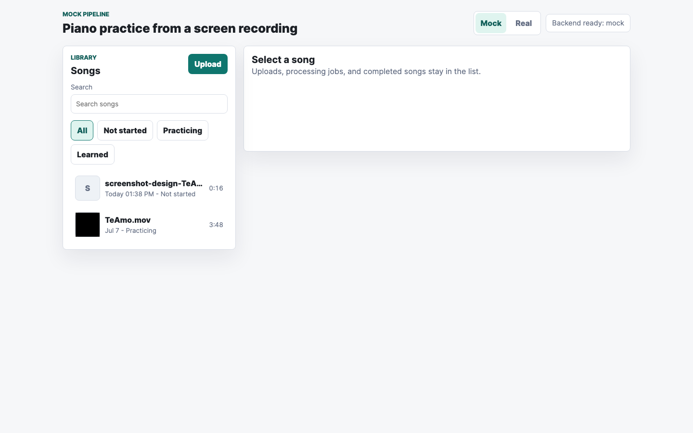
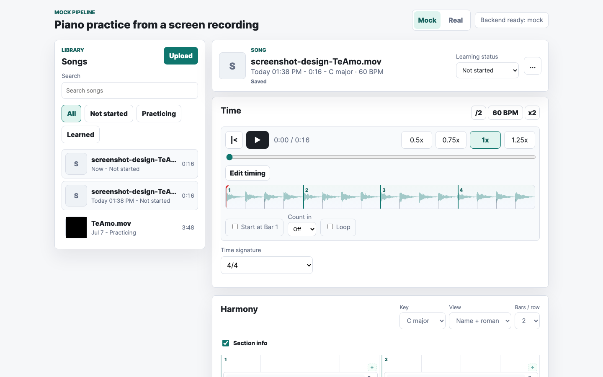
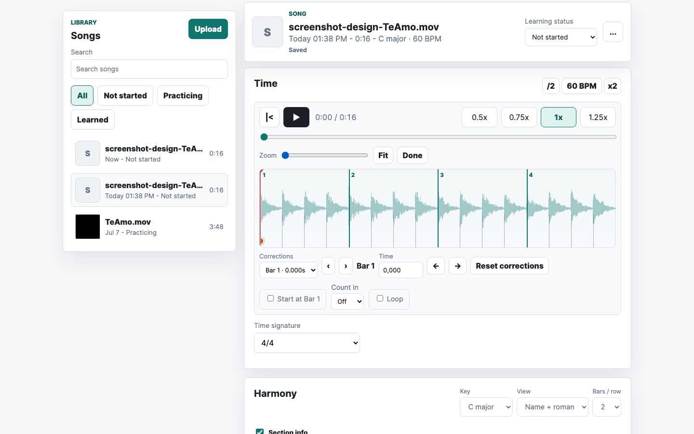
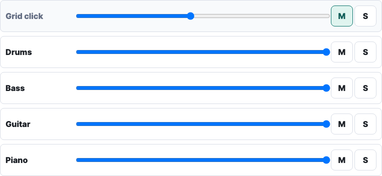
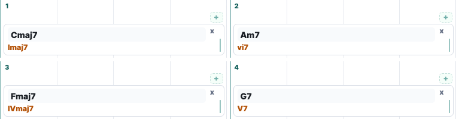
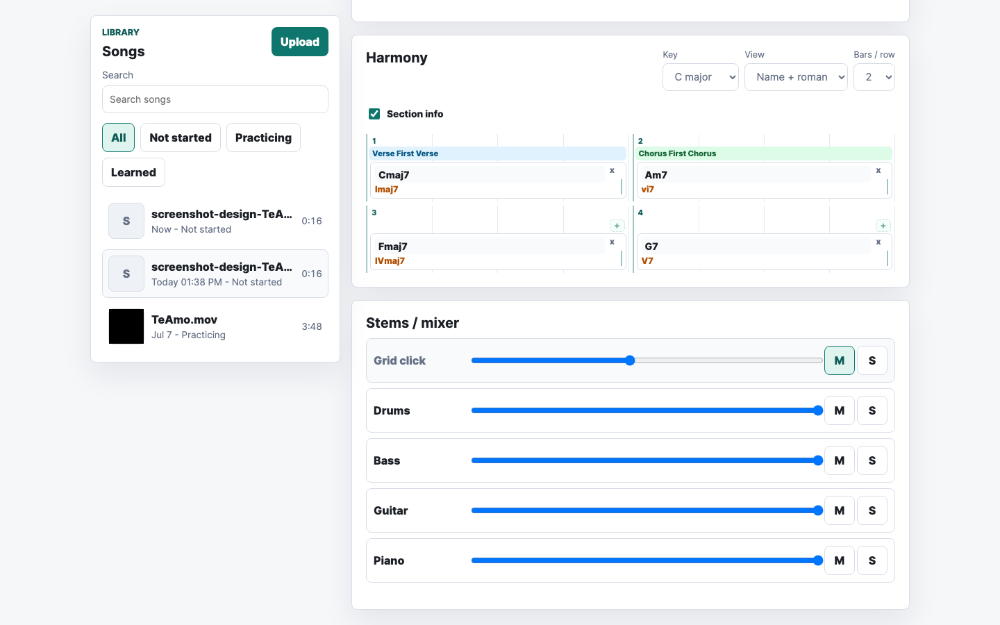
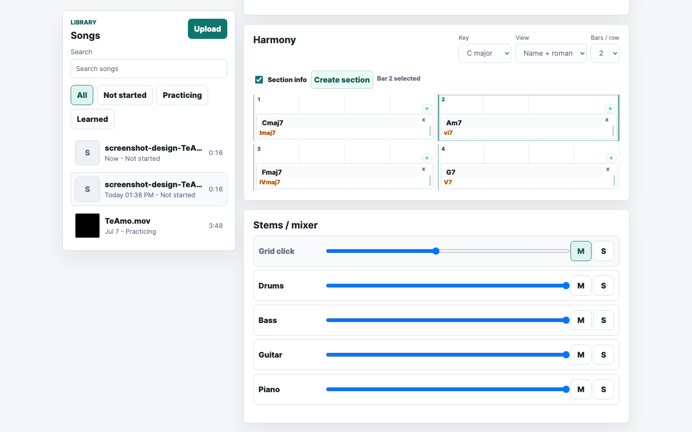
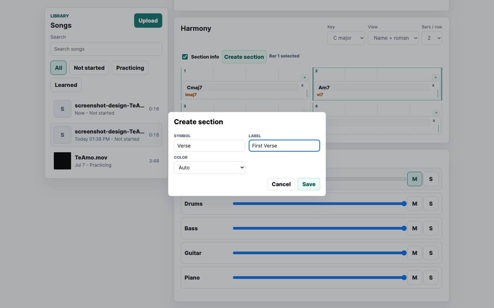
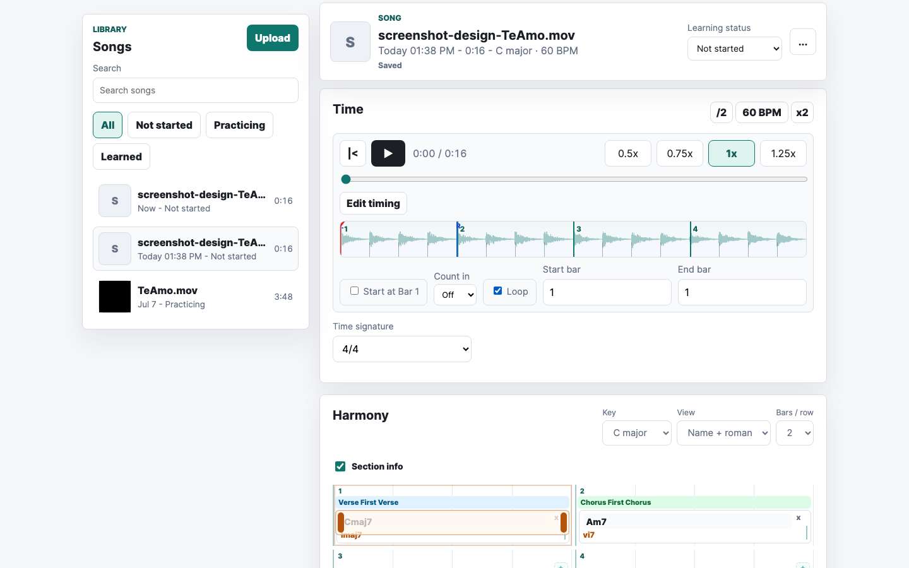
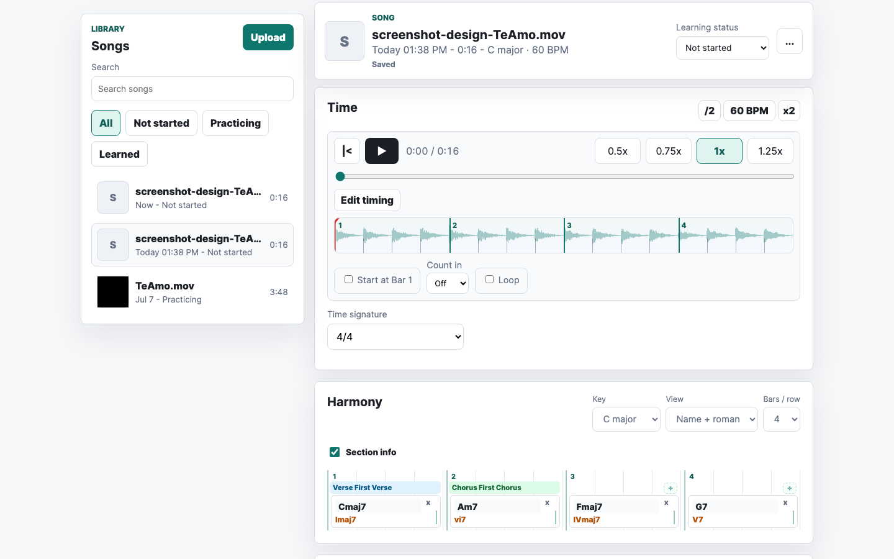

# Design Brief: Piano Practice App

> **Purpose of this document:** Provide a visual designer (or Claude Design) with enough context to propose multiple visual design directions for this application. Screenshots of the current functional prototype are included throughout.
>
> **Companion:** `MOISES_ANALYSIS.md` — competitive/pattern analysis of Moises and peer apps (Chordify, Songsterr, Yousician, Simply Piano, Flowkey, Ultimate Guitar). Read alongside this brief.

---

## What the app does

A pianist uploads a screen recording of a song (from YouTube, TikTok, or similar). The app uses AI to:
1. Separate the audio into individual stems: drums, bass, guitar, piano, vocals
2. Detect the song's key, tempo, time signature, and chord sequence
3. Deliver an interactive practice session

The central learning mechanic: **mute the piano stem and play that part yourself**, while the rest of the band keeps going. Think of it as a smart karaoke machine for piano players.

---

## Who uses it

- Adult hobbyist or serious music student learning piano by ear
- Practices at home, alone, with a laptop or iPad
- Knows basic notation; not necessarily a music theorist
- Motivated by learning specific songs, not by formal exercises
- Often practices with reduced lighting; dark mode is likely preferred

---

## Current visual state

The prototype is fully functional but has developer-default styling: a teal accent color, plain white cards, stock blue range sliders, and no typographic personality. The screenshots below show the real running UI.

---

## Screen-by-screen breakdown

### 1. App shell and library (empty state)

Two-panel layout: a narrow sidebar on the left for the song library, and a large detail area on the right.

**Left sidebar:**
- "LIBRARY / Songs" heading
- Upload button (primary CTA)
- Search field
- Filter chips: All / Not started / Practicing / Learned
- Song rows with: artwork (letter avatar or video thumbnail), title, date, duration, status

**Right panel (empty state):**
- "Select a song" heading with supporting text

**Design considerations:**
- The sidebar and detail panel feel equal in visual weight. The detail area should dominate.
- "Upload" is the entry point for new users — it needs to feel inviting, not utilitarian.
- Song rows need a learning-status indicator that's glanceable.

---

### 2. Song selected — header and metadata

When a song is selected, the right panel shows a sticky header with song metadata.

**Song header contains:**
- Album art (letter avatar; real thumbnail when available)
- Song title (filename currently, e.g. "TeAmo.mov")
- Metadata line: date · duration · detected key · detected BPM
- Save status ("Saved" / "Saving…")
- Learning status dropdown (Not started / Practicing / Learned)
- "…" overflow menu (Rename, Delete)

**Design consideration:**
- The filename-as-title is a known UX limitation of the POC. Design should handle long, ugly filenames gracefully (truncation, etc.).
- The key and BPM are musically significant — they deserve more visual emphasis than the timestamp.

---

### 3. Time panel — transport, waveform, and playback controls

The Time panel is always visible above the chord chart. It contains all timing controls.

**Transport row:**
- Back-to-start button (|<)
- Play/pause button
- Time readout (current / total)
- Speed buttons: 0.5x · 0.75x · **1x** · 1.25x (one active at a time)

**Waveform timeline:**
- Teal waveform rendered on a canvas
- Beat grid overlay: thin vertical lines for beats, thicker lines for bar downbeats, bar number labels
- Red playhead line that moves during playback
- When loop is active: loop start (L) and end (R) markers appear on the waveform

**Below timeline:**
- "Edit timing" button (enters timing correction mode)
- "Start at Bar 1" checkbox
- Count-in dropdown (Off / 1 bar)
- Loop checkbox → expands to show loop start/end bar inputs
- Time signature dropdown (4/4, 3/4, 5/4, 6/8, 7/8, 12/8)

**Design considerations:**
- The waveform is the visual anchor of the whole experience — it should feel like music, not a data chart.
- Bar numbers on the grid are essential for a musician correlating what they hear with the chord chart below.
- Speed controls are used constantly during practice — they need to be fast to reach and hard to misread.

---

### 4. Timing edit mode

Entered by clicking "Edit timing". This mode lets users correct the beat grid by dragging bar markers on the waveform.

**Changes from normal mode:**
- "Edit timing" button replaced by: **Zoom** slider + **Fit** button + **Done** button
- Waveform becomes zoomable (horizontal scroll, pinch on touch)
- Bar markers on the grid become draggable (shown as taller, interactive elements)
- A "Corrections" panel appears below the waveform:
  - Dropdown listing all timing corrections (e.g. "Bar 1 · 0.000s")
  - Prev/Next navigation buttons
  - Bar label ("Bar 1")
  - Time input field (seconds, 3 decimal places)
  - Left/right nudge buttons (±0.01s)
  - "Reset corrections" or "Remove correction" button

**Design considerations:**
- This is an advanced power-user mode that most users rarely enter. It should feel distinct from practice mode but not alarming.
- The waveform close-up (zoomed) is where the user spends most time here — it must clearly show draggable bar anchors vs. regular beat markers.
- Anchored/corrected bars should look visually distinct from estimated bars.

---

### 5. Mixer (stems / volume control)

The mixer sits in the bottom-right of the practice view, below the chord chart.

**One row per stem:**
- Stem name (Grid click / Drums / Bass / Guitar / Piano / Vocals / Other)
- Horizontal volume slider (range 0–1)
- **M** button: mute this stem
- **S** button: solo this stem (mutes all others)

**States:**
- Muted row: visually dimmed
- Soloed row: highlighted; all others muted
- Metronome ("Grid click") is the first row — it's always present regardless of which stems exist

**Design considerations:**
- The piano stem is the most important row — it's the one users mute to practice. It needs prominence or a distinct visual treatment.
- M and S buttons currently look identical; their states (active/inactive) are shown only by border color. This is easy to miss.
- Volume sliders currently use the browser default (blue). They should feel musical — like a mixing desk.
- When a stem is muted, the row should clearly communicate "this stem is silent."

---

### 6. Chord chart — basic view

The Harmony panel shows the chord sequence laid out in a grid. Each row contains N bars (configurable: 1, 2, 4, or 8 per row).

**Controls above the grid:**
- "Harmony" heading
- Key dropdown (C major, A minor, etc. — 32 options)
- View dropdown: Name + roman / Name / Roman
- Bars/row dropdown: 1 / 2 / 4 / 8

**Each bar contains:**
- Bar number in the top-left corner
- One or more chord cards (see below)
- "+" buttons in each empty beat cell (to add a chord)
- "+" section button (top of bar, visible when section info is on)

**Chord card:**
- Chord name (e.g. "Cmaj7") — editable inline by clicking
- Roman numeral (e.g. "Imaj7") — computed from key
- Delete button (×) in top-right corner
- Resize handle on the right edge (drag to extend/shrink the chord's duration)
- Draggable to another bar (drag and drop)
- Visual state: **active** chord (currently playing) is highlighted

**Design considerations:**
- The chord grid is read in real-time while music plays — legibility at a glance is critical.
- Active chord highlight must be instantly visible, not subtle.
- The two-line format (chord name + roman numeral) is musically useful but compact — the visual hierarchy between the two must be clear.
- Chords added by the user vs. chords from the AI analysis should look different (user-added are "owned").
- The resize handle is invisible until hovered — discoverability is low.
- Bar number should be subtle enough not to compete with chord content.

---

### 7. Chord chart — with section info and section bands

When "Section info" is checked, colored horizontal bands appear above bars to label song structure.

**Section bands:**
- Span one or more bars
- Color-coded: Blue (default), Green, Amber, Rose
- Show: symbol + label (e.g. "Verse First Verse", "Chorus First Chorus")
- Edit button (pen icon) on the first bar of the section
- Remove button (×) on the first bar of the section

**Bar selection for sections:**
- Clicking a bar background selects it (teal outline appears)
- Shift-click extends the selection
- A "Create section" button appears in the toolbar when a valid range is selected
- "Bar N selected" / "Bar N–M selected" shown as summary text

**Design considerations:**
- Section bands are the most colorful element in the UI — they carry a lot of visual weight. Their color system (blue/green/amber/rose) should integrate with the overall palette.
- The band label (symbol + full label) needs to fit in potentially narrow column widths.
- When sections are present, bars within them have a background tint; this interacts with the active chord highlight.
- Bars 3 and 4 above (without section bands) still show "+" buttons because they're in unassigned territory.

---

### 8. Section create / edit dialog

A modal dialog for creating or editing a section.

**Fields:**
- **Symbol** — short identifier, max 12 chars (e.g. "A", "Verse", "Bridge")
- **Label** — full display name, max 40 chars (e.g. "First Verse")
- **Color** — Auto / Blue / Green / Amber / Rose

**Actions:** Cancel · Save

**Edit dialog additionally has:**
- Start bar (number input)
- End bar (number input)
- Delete section option

**Design considerations:**
- The symbol and label serve different purposes: symbol is for compact display in the band, label is for full context. They need clear visual distinction.
- The color picker (currently a `<select>` dropdown) is a good candidate for a visual color swatch picker.
- The dialog backdrop shows the chord grid behind it — make sure the contrast is sufficient.

---

### 9. Loop controls on the chord chart

When loop is enabled, a visual loop region appears overlaid on the chord grid.

**Loop region:**
- Semi-transparent overlay spanning loop start → end bars
- Draggable start handle (left edge) with "L" or arrow indicator
- Draggable end handle (right edge) with "R" or arrow indicator
- Dragging the middle of the region moves the entire loop

**Loop settings (in Time panel):**
- Loop checkbox → reveals: Start bar input · End bar input
- Inputs show bar numbers; they update live as handles are dragged

**Design considerations:**
- The loop region must be clearly visible over section bands AND chord cards without obscuring chord names.
- Start and end handles need to be large enough to touch-tap on iPad.
- The loop overlay currently has very low visual distinction from selected section bars.

---

### 10. Chord chart — 4 bars per row

At wider bar density, the chord grid compresses.

**Design considerations:**
- At 4 bars/row, chord cards become narrow. The two-line chord+roman format becomes tight.
- Section bands at 4/row look better — they span more columns and are more legible.
- For iPad use, 4/row may be the preferred density.

---

## Key design tensions to resolve

### 1. Information density vs. legibility
The practice view packs four panels into one screen: transport, waveform, chord grid, and mixer. A musician practicing in real time needs to be able to glance at the chord chart and read it instantly. Every panel competes for visual attention.

### 2. Practice mode vs. edit mode
The user alternates between:
- **Practice mode:** listening, playing, using transport and mixer
- **Edit mode:** correcting chords, adding sections, adjusting timing

Currently there's no visual distinction between these modes. A designer could explore whether these should feel like different states of the app.

### 3. Active chord tracking
The currently playing chord should be the most visually prominent element in the chord grid at any moment. Currently it's a subtle highlight. This is the single most important real-time visual cue in the app.

### 4. Musical personality vs. professional clarity
The app is a music tool but also an analytical one. It should feel warm enough to be inspiring, but clear and precise enough to be trusted. A pure "dark DAW" aesthetic might feel too technical; a "sheet music" aesthetic might feel too analog.

---

## Current color usage

| Element | Current color |
|---|---|
| Accent / primary | Teal (`#0f766e` range) |
| Waveform | Teal (`rgba(15,118,110,0.58)`) |
| Playhead | Red |
| Volume sliders | Browser default blue |
| Active filter chip | Teal outline |
| Section — Blue | Light blue band |
| Section — Green | Light green band |
| Section — Amber | Light amber band |
| Section — Rose | Light rose band |
| Roman numerals | Orange/amber |
| Background | Light grey (`#f3f4f6` range) |
| Cards | White |

---

## Design directions to explore

The brief asks for multiple visual directions. Suggested starting points:

**Direction A — Warm Acoustic**
Draws from studio recording aesthetics: warm off-whites, analogue wood/felt textures, handwritten-feeling chord labels, generous whitespace. The waveform could look like tape. The mixer like vintage faders.

**Direction B — Modern Music App**
Clean, dark-by-default, inspired by Spotify / Apple Music but purpose-built for learning. Strong typographic hierarchy. Color used sparingly for status (active chord, sections). Feels like a premium instrument app.

**Direction C — DAW-Lite**
Directly inspired by Logic Pro, Ableton, GarageBand. Dark grey panels, precise monospace numerals, highly information-dense. Chord grid resembles a piano roll. Skews toward musicians who are comfortable with software instruments.

---

## What the designer should decide

1. **Dark or light mode as default?** (Users practice at varied lighting levels)
2. **How to visually separate practice mode from edit mode?**
3. **What should the "active chord" state look like?** (This is the most critical real-time signal)
4. **How to give the piano stem row visual prominence in the mixer?**
5. **Should the chord grid feel more like sheet music or more like a grid/table?**
6. **How should section color bands interact with the overall palette?**
7. **What to do with the waveform — purely functional or a visual centerpiece?**
