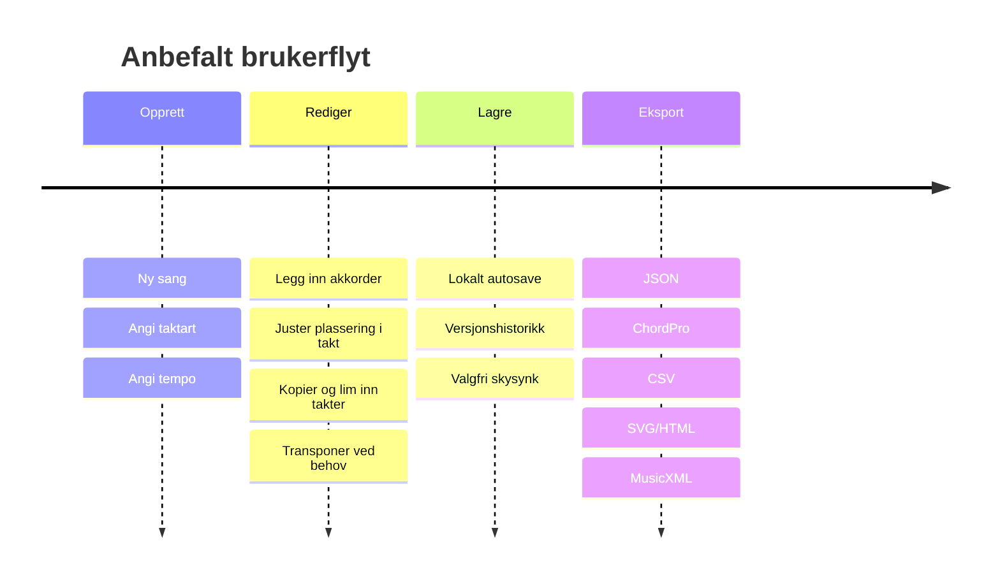
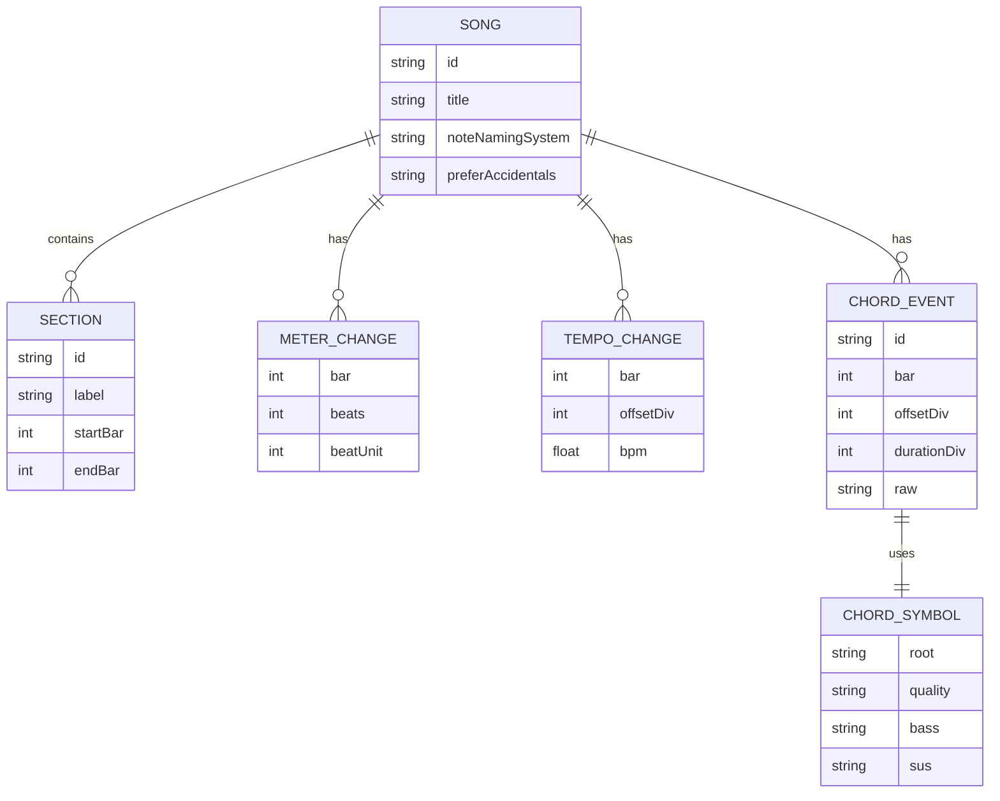

# Dypanalyse av måter å presentere akkorder i forhold til takt i en redigerbar app

## Executive summary

For en app som skal vise og redigere akkorder plassert presist i forhold til takt, er den sterkeste løsningen å skille tydelig mellom **intern datamodell** og **visningsnotasjon**. Internt bør appen bruke en **event-basert, takt- og subdivisjonsnøyaktig modell** der akkorder ligger på en eksplisitt posisjon i en takt og har en eksplisitt varighet. Utad bør samme data kunne rendres som minst fire ulike visninger: en enkel linjebasert akkordoversikt, en grid/timeline-editor, en beat-justert inline-visning og en eksportvennlig SVG/HTML-visning. Dette følger både praksisen i standarder som MusicXML og ChordPro, og mønstrene i verktøy som MuseScore, iReal Pro, Ultimate Guitar og Band-in-a-Box. citeturn23view2turn23view3turn24view3turn20view4turn26view0turn22view2

Den viktigste produktbeslutningen er derfor ikke “hvilken notasjon som er best”, men **hvilken notasjon som er best til hva**. Tekstbaserte formater som ChordPro er svært gode for enkel skriving, versjonskontroll og deling, men de er svake på presis sub-beat-plassering. MusicXML er sterkt på musikalsk interoperabilitet og eksplisitt posisjonering gjennom `divisions`, `offset` og `harmony`, men er tungt og mer komplekst enn det et akkordfokusert MVP trenger. iReal Pro viser at et fast grid-format kan være ekstremt brukervennlig for rytmisk akkordarbeid, mens MuseScore viser styrken i tastaturbasert innskriving, navigasjon mellom slag og eksport til flere formater. citeturn23view2turn23view3turn24view1turn26view0turn20view4turn20view3

Den anbefalte minimumsløsningen er derfor et **lite, utvidbart JSON-format** med disse grunnblokkene: sangmetadata, meter- og tempokart, seksjoner, akkordhendelser, og et lite lag med rendringshint. Posisjon bør lagres som **heltallsdivisjoner per firedel** eller som annen eksplisitt subdivisjonsenhet, slik MusicXML gjør, fordi det gir en enkel vei fra heltakt via åttedel til 16.-del og videre til tripletter senere uten å bryte filformatet. citeturn23view2turn23view3

For lagring og synkronisering bør produktet starte **local-first**: lokal persistent lagring for raske redigeringer uten nett, valgfri skysynk for backup og deling, og først deretter ekte samtidssamarbeid dersom det faktisk er et kjernebehov. Ink & Switchs local-first-prinsipper, sammen med CRDT-baserte systemer som Yjs og Automerge, viser hvorfor denne rekkefølgen er robust: den gir offline-bruk, rask UI, brukerkontroll og en senere vei til sanntidssamarbeid uten å låse produktet til en “alt via server”-modell. citeturn27view2turn27view3turn27view4

Tilgjengelighet og internasjonalisering må inn tidlig, ikke sent. Norske krav og veiledning fra Uutilsynet gjør det klart at all funksjonalitet må kunne brukes med tastatur, og at kontrastkrav gjelder også for tekst og fokusmarkeringer i UI. For akkordapper kommer i tillegg musikkspesifikke krav: brukere må kunne velge mellom enharmoniske skrivemåter, mellom notenavnssystemer som common, tysk og skandinavisk, og mellom bokstav- og nummersystemer som Nashville. For HTML/SVG-visninger må tekstretning og inline bidi-håndtering være eksplisitt løst dersom produktet skal støtte høyre-til-venstre-språk. citeturn28view0turn28view1turn32view0turn20view4turn28view3turn28view4turn33view0

Konklusjonen er klar: **MVP bør være en akkordfokusert grid-/timeline-editor med linebasert leservisning, transponering, enkel import/eksport og et lite, presist internt format**. Full MusicXML-rundtur, sanntidssamarbeid og mer avansert notebasert/lead-sheet-lignende redigering bør komme etter at kjernebruksmønstrene er validert. Melodi, tekst, gitargrep og playback er i oppgaven uspesifisert, og bør derfor behandles som valgfrie, separate lag heller enn som del av kjernen.

## Rammeverk for vurdering og designpremisser

Denne analysen tar utgangspunkt i at appen skal håndtere **akkorder i forhold til takt**, ikke full notasjon. Det betyr at nøyaktig plassering i takt, tydelig lesbarhet, enkel redigering, eksportmuligheter og interoperabilitet er viktigere enn noteinput, artikulasjon eller instrumentspesifikke grepdiagrammer. Melodi, tekst, playback, harmonisering, audioanalyse og gitargrep er uspesifisert i bestillingen og vurderes derfor som sekundære eller valgfrie lag.

Når man sammenligner notasjonstyper for dette problemet, er det spesielt fem kriterier som avgjør kvaliteten: hvor presist formatet uttrykker tid innenfor en takt, hvor raskt mennesker kan lese visningen, hvor effektivt det kan redigeres, hvor godt det kan eksporteres til andre verktøy, og hvor robust det er for tilgjengelighet og internasjonalisering. MusicXML viser hvor eksplisitt og interoperabel en modell kan være gjennom `divisions`, `offset` og `harmony`, mens MuseScore og Band-in-a-Box viser praktiske UI-konsekvenser av beat-basert navigasjon, range selection, lead-sheet-visning og flere redigeringsmodi. citeturn23view2turn23view3turn20view0turn20view1turn22view1turn22view2

Et viktig premiss er også at “samme akkorddata” ofte må kunne vises forskjellig i forskjellige kontekster. MuseScore støtter både akkordsymboler, romertallsanalyse og Nashville Number System, og ChordPro har både vanlige tekstlinjer, seksjoner og grid-miljøer. Dette peker mot en arkitektur der **intern sannhet er én datamodell**, mens “linjevisning”, “chart”, “grid” og “eksport-XML” er ulike renderer-lag. citeturn20view4turn24view3turn32view0



Diagrammet over er en anbefalt produktflyt basert på mønstre som går igjen i ChordPro, MuseScore, iReal Pro og Band-in-a-Box: oppretting med få parametre, redigering i en taktforståelig UI, ikke-destruktiv lagring og flere eksportveier. citeturn24view0turn20view1turn26view2turn22view2

## Notasjonstyper og anbefalt presentasjonsstrategi

Det finnes ikke én notasjonstype som dominerer på alle akser. For dette produktet er det mer fruktbart å tenke i en **arbeidstaksonomi** av ni representasjoner: linjebasert tekstformat, chord chart, lead-sheet-lignende visning, grid/tablature-like timeline, beat-aligned inline chords, chord symbols over lyrics, piano-roll style, time-stamped JSON/CSV og SVG/HTML-renderinger. Denne taksonomien er analytisk, men den bygger på konkrete egenskaper i ChordPro, ABC, MusicXML, MuseScore, iReal Pro, Ultimate Guitar og Band-in-a-Box. citeturn24view3turn12search7turn23view3turn20view4turn26view0turn21view0turn22view2

**Tekstbasert linjeformat** er best når målet er rask skriving, enkel eksport, diff/versjonskontroll og lav friksjon. ChordPro er referansepunktet her: det er et enkelt tekstformat for akkorder med metadata som tittel, toneart, takt og tempo, samt egne seksjonsdirektiver som chorus, verse, bridge og grid. Svakheten er at presis sub-beat-plassering er indirekte og ofte må “simuleres” med mellomrom eller layoutkonvensjoner i stedet for å være eksplisitt data. citeturn24view2turn24view3turn17search13

**Chord charts** og **grid-baserte charts** er ofte best for ren harmonisk orientering. iReal Pro er her et viktig eksempel: formatet bruker et visuelt “chord progression format” der progresjonen beskrives som en streng av symboler, med 16 celler per linje og vanligvis 4 celler per takt, plusssymboler for taktstreker, repetering, time signatures og seksjonsmarkører. Det er mye mer taktforankret enn ren tekst, men mindre egnet for fri, finjustert plassering enn en helt generell eventmodell. citeturn26view0

**Lead sheets** er nyttige når akkorder skal stå i en musikalsk notert kontekst. I denne bestillingen er melodi uspesifisert, så en full lead sheet er ikke kjerneformatet. Likevel er det verdt å støtte en “lead-sheet-lignende” visning med akkorder over tomme takter eller slash-notation, fordi MuseScore og Band-in-a-Box begge viser hvor effektivt dette er for lesing, utskrift og eksport. citeturn20view4turn22view1turn22view2

**Beat-aligned inline chords** er etter min vurdering den mest lovende leservisningen for dette produktet. Den kombinerer lesbarheten til tekst med rytmisk presisjon: akkorden står i en eksplisitt beat-kolonne, men uten tung notegrafikk. Du får dermed et notebløst “lesebrett” som kan vise én takt per linjeblokke eller flere takter per rad. Dette bygger på de samme prinsippene som MuseScores beat-navigasjon og iReal Pros cellebaserte charts, men passer bedre når produktets kjerne er eksplisitt akkordplassering uten krav om melodi eller grep. citeturn20view4turn26view0

**Chord symbols over lyrics** er en klassiker, men i dette prosjektet bør det være en sekundær renderer fordi tekst er uspesifisert. ChordPro er sterkt her, og Ultimate Guitar bruker lignende lesemønstre i “Chords”-visning med autoscroll, transpose og flats/sharps-visning. Men dersom teksten ikke er obligatorisk data i modellen, må denne renderer-typen aldri være den primære sannheten i systemet. citeturn24view1turn21view0turn21view3

**Piano-roll style** og andre horisontale tidslinjer er utmerkede for redigering, selv om de ofte blir mer “DAW-aktige” enn tradisjonelle akkordark. Band-in-a-Box har både chord sheet og piano roll-vinduer, og dette illustrerer et viktig poeng: piano-roll-liknende visninger er ofte bedre for flytting, snapping, zoom og visuell oversikt over varighet, mens linebasert eller chart-basert visning er bedre for lesing. citeturn22view1turn22view2turn22view3

**Time-stamped JSON/CSV** og **SVG/HTML-renderinger** er ikke notasjoner i menneskelig-forstand, men de er kritiske som henholdsvis intern/interchange-representasjon og rendringsformat. MusicXML viser hvorfor eksplisitt tidsinformasjon er verdifullt; SVG 2 viser samtidig at SVG kan gjøres fokus- og ARIA-vennlig, og W3C peker eksplisitt på støtte for `title`, `tabindex`, ARIA-attributter og synlig fokus i SVG. citeturn23view2turn23view3turn33view0

Tabellen under er en analytisk vurdering av hvilke notasjonstyper som egner seg til hva i akkurat denne produktkategorien.

| Notasjonstype | Presisjon i takt | Lesbarhet | Redigerbarhet | Interoperabilitet | Kompleksitet | Anbefalt bruk |
|---|---:|---:|---:|---:|---:|---|
| Tekstbasert linjeformat | Lav til middels | Høy | Høy for enkel tekst | Høy | Lav | Import/export, enkel deling, diff |
| Chord chart | Middels | Høy | Høy | Middels | Lav til middels | Daglig bruk, rehearsal charts |
| Lead-sheet-lignende visning | Høy | Høy for musikere | Middels | Høy | Høy | Utskrift, noteorientert eksport |
| Grid/tablature-like timeline | Høy | Middels | Svært høy | Middels | Middels | Primær editor |
| Beat-aligned inline chords | Høy | Svært høy | Høy | Middels | Middels | Primær leservisning |
| Chord symbols over lyrics | Lav til middels | Høy når tekst finnes | Middels | Høy | Lav | Sekundær renderer når tekst finnes |
| Piano-roll style | Høy | Middels | Svært høy | Middels | Middels til høy | Avansert redigering |
| Time-stamped JSON/CSV | Svært høy | Lav | Høy maskinelt | Svært høy | Lav til middels | Intern modell, API, import/export |
| SVG/HTML-rendering | Avhenger av kilde | Høy | Lav direkte | Høy | Middels | Visning, print, embeddable output |

Min klare anbefaling er derfor en **to-lags strategi**: bruk **grid/timeline** som hovededitor og **beat-aligned inline chords** som hovedleservisning. Legg så på eksport-/importadaptere for tekstformat, MusicXML og en enkel CSV/JSON-strøm. Dette gir den beste balansen mellom menneskelig lesbarhet og teknisk presisjon. citeturn20view4turn26view0turn22view2turn23view3

Et konkret SVG/HTML-mockup for en linjebasert akkordvisning kan se slik ut:

```html
<div class="chord-line-view" role="group" aria-label="Akkorder for takt 1 til 2">
  <svg
    xmlns="http://www.w3.org/2000/svg"
    viewBox="0 0 760 120"
    width="100%"
    role="img"
    aria-labelledby="title desc">
    <title id="title">Beat-justert akkordlinje</title>
    <desc id="desc">
      To takter i 4/4. Cmaj7 på slag 1 i takt 1, G/B på slag 3,
      Am7 på slag 1 i takt 2 og D7sus4 på slag 3.
    </desc>

    <!-- taktramme -->
    <rect x="20" y="30" width="720" height="40" rx="6" />
    <line x1="380" y1="30" x2="380" y2="70" />

    <!-- beat-grid -->
    <line x1="110" y1="30" x2="110" y2="70" />
    <line x1="200" y1="30" x2="200" y2="70" />
    <line x1="290" y1="30" x2="290" y2="70" />
    <line x1="470" y1="30" x2="470" y2="70" />
    <line x1="560" y1="30" x2="560" y2="70" />
    <line x1="650" y1="30" x2="650" y2="70" />

    <!-- beat labels -->
    <text x="60"  y="92">1</text>
    <text x="150" y="92">2</text>
    <text x="240" y="92">3</text>
    <text x="330" y="92">4</text>
    <text x="420" y="92">1</text>
    <text x="510" y="92">2</text>
    <text x="600" y="92">3</text>
    <text x="690" y="92">4</text>

    <!-- akkorder -->
    <text x="35"  y="22">Cmaj7</text>
    <text x="225" y="22">G/B</text>
    <text x="395" y="22">Am7</text>
    <text x="575" y="22">D7sus4</text>
  </svg>
</div>
```

For tilgjengelig SVG bør du eksplisitt bruke `role`, `title`, eventuelt `aria-label`/`aria-labelledby`, og fokusmodell der interaktive elementer finnes. SVG 2 peker på `tabindex`, synlig fokus, ARIA og `title` som sentrale tilgjengelighetsmekanismer, og W3C ACT-dokumentasjonen viser at ikke-dekorative SVG-er bør ha et ikke-tomt tilgjengelig navn. citeturn33view0turn33view1

## UI og UX for visning og redigering

Et godt UI for denne appen bør være **redigeringsførst**, ikke dokumentførst. MuseScore viser at tastaturdrevet innskriving og flytting beat-for-beat er ekstremt effektivt når akkorder er strukturert tekst, mens iReal Pro viser verdien av et fokusert editor-tastatur, undo, alternatakkorder, time signatures og seksjonssymboler. Ultimate Guitar viser hvor nyttige visningsverktøy som autoscroll, transpose, fontstørrelse og “use flats” er i lesemodus. Band-in-a-Box kompletterer bildet med chord sheet, lead sheet, fake sheet, chord display-valg og piano roll. citeturn20view4turn26view2turn21view0turn21view3turn22view1turn22view2

De viktigste interaksjonsmønstrene for dette domenet er derfor: **grid editor**, **drag-and-drop på tidslinje**, **scrubber/loop**, **zoom**, **quantize/snap**, **copy/paste**, **multi-bar selection** og **undo/redo**. MuseScore dokumenterer range-seleksjon og kopier/lim inn på tvers av takter, og iReal Pro dokumenterer undo, looping og redigering per celle/takt. Band-in-a-Box dokumenterer også scrub og loop i notasjon-/visningsvinduet. citeturn20view1turn26view2turn26view3turn22view2

I praksis anbefaler jeg to hovedvisninger i editoren. Den første er en **bar-grid editor**, der hver takt er delt i eksplisitte beat- og subdivisjonsceller. Den andre er en **horisontal timeline-editor**, der akkorder opptrer som blokker med start og varighet. Brukeren bør kunne bytte mellom dem uten at data endres. Grid passer bedre til “sett inn akkord på slag 3+”, mens timeline passer bedre til “flytt akkorden litt bakover, forleng den til neste akkord”. Dette følger samme arbeidsdeling som iReal Pro kontra Band-in-a-Box piano roll og notation/chord sheet. citeturn26view0turn22view1turn22view2turn22view3

For **drag-and-drop** bør mindre justeringer alltid være kvantisert mot valgt snap-verdi. Et drag som ikke er kvantisert vil fort oppleves musikalsk uklart i en akkordapp. Derfor bør UI ha en tydelig snap-kontroll med trinn som: hel takt, halv takt, firedel, åttedel, 16.-del, og senere eventuelt triolbaserte snap-verdier. MusicXMLs `divisions`-tenkning er et godt teknisk forbilde for dette, fordi den lar renderer og editor dele samme tidsenhet. citeturn23view2

For **copy/paste** og **multi-bar selection** bør produktet kopiere hele musikalske områder, ikke bare rå tekst. MuseScore beskriver eksplisitt range selection på tvers av måletid og staver, og copy/paste av både hele passasjer og enkeltobjekter som akkordsymboler. I denne appen bør tilsvarende skje på områdenivå: marker takt 9–16, kopier, lim inn ved takt 25, med valgfritt “inkluder tempo/meter-endringer” som ekstra kontekst. citeturn20view1turn9search8

For **undo/redo** bør modellen være hendelsesbasert og musikksemantisk. iReal Pro dokumenterer undo i editoren, men for et nytt produkt ville jeg gå lenger: “Undo transpose”, “Undo quantize”, “Undo move 4 bars”, ikke bare “undo text”. Dette er spesielt viktig når internmodellen ikke er tekstlinjer, men akkordhendelser med posisjon og varighet. citeturn26view2

For **tempo og taktart** bør disse ligge i en egen “song inspector” eller toppstripe, med eksplisitt støtte for endringer per takt. iReal Pro støtter time signature changes per measure, og Band-in-a-Box og MuseScore viser begge hvordan takt og visning påvirker layout, notasjon og navigasjon. Det betyr at appen bør skille mellom **global default** og **lokale overrides**. citeturn26view3turn22view2turn20view4

For **akkordvarianter** bør brukeren kunne velge mellom to inputmåter: fri tekst og strukturert builder. MuseScore skriver inn akkordsymboler i plain text og parser dem til rot, kvalitet og modifikatorer som `sus`, `no 3`, `7` og så videre. iReal Pro har tilsvarende et chord quality-valg og alternate chords. Den beste UX-en er derfor å la brukeren skrive `D7sus4/F#`, men samtidig vise en inspeksjonspanelvisning der appen har forstått rot, kvalitet, adds, omits og bass. citeturn20view4turn26view2

For **transponering** bør det finnes minst tre moduser: “visuelt” bytt notenavn uten å endre underliggende struktur, “harmonisk” flytt akkordhendelsene i semitoner, og “display only” endre bare preferanse for flats/sharps. ChordPro dokumenterer eksplisitt transponering i semitoner og kontroll over sharps/flats, mens Ultimate Guitar skiller mellom Transpose, Pitch og Use Flats. Den distinksjonen er svært nyttig og bør kopieres konseptuelt. citeturn24view1turn31search10turn21view0

Desktop og mobil bør ikke bare være samme skjerm i to størrelser. På **desktop** anbefaler jeg tastatur-først arbeidsflyt: piltaster, Enter for ny akkord, Tab til neste slag, Shift+Tab tilbake, Cmd/Ctrl+C/V, og flervalgsmarkering. Dette støttes både av Uutilsynets tastaturkrav og av de effektive mønstrene i MuseScore. På **mobil** bør hovedinteraksjonen være tap-velg-rediger via bottom sheet, med store snap-kontroller, langtrykk for multi-select og tydelig zoom mellom “sang”, “seksjon”, “takt” og “slag”. Alle funksjoner bør fortsatt være tilgjengelige uten presis pekerenhet, i tråd med norske tilgjengelighetskrav. citeturn28view0turn20view4

Tabellen under oppsummerer de UI-mønstrene som gir mest verdi i et akkordtakt-produkt.

| UI-mønster | Verdi | Vanskelighetsgrad | Særlig godt for | Risiko / svakhet |
|---|---:|---:|---|---|
| Grid editor | Svært høy | Middels | Presis plassering per slag | Kan bli tett på mobil |
| Timeline med blokker | Høy | Middels | Flytting, varighet, zoom | Kan virke “DAW-aktig” |
| Drag-and-drop | Høy | Middels | Raske justeringer | Må kombineres med snap |
| Quantize/snap | Svært høy | Lav | Musikalsk konsistens | Må være synlig og forståelig |
| Timeline scrubber | Middels til høy | Middels | Gjennomgang og kontroll | Krever tydelig sammenheng med takt |
| Zoom nivåer | Svært høy | Middels | Mobil + lange sanger | Krever god layoutlogikk |
| Multi-bar selection | Svært høy | Middels | Repetisjon, arrangering | Kan være vanskelig på små skjermer |
| Copy/paste | Svært høy | Lav | Standard redigering | Må være musikksemantisk |
| Undo/redo | Svært høy | Lav til middels | Tillit i redigering | Krever god hendelsesmodell |
| Autoscroll / lesemodus | Høy | Lav | Fremføring / øving | Ikke erstatning for god editor |

## Datamodeller, filformater og skjemaer

Det mest robuste utgangspunktet er å tenke i tre lag: **kanonisk internmodell**, **interchange-formater** og **rendringsformater**. Den interne modellen bør være liten, presis og enkel å validere. Interchange bør prioritere MusicXML, ChordPro, ABC og CSV/JSON. Rendring bør prioritere HTML/SVG og PDF. MuseScore eksporterer bredt, inkludert MusicXML, MIDI, MEI, PDF og PNG, og iReal Pro eksporterer blant annet PDF, MusicXML og sitt eget format. Dette viser at man får størst frihet ved å holde internmodellen liten og bygge adaptere ut mot tyngre standarder. citeturn20view3turn9search6turn7view2

MusicXML er den sterkeste åpne standarden dersom produktet må snakke med noteprogrammer. `harmony`-elementet representerer akkordsymboler og kan inneholde `root`, `kind`, `bass`, `degree` og `offset`. `divisions` angir hvor mange tidsenheter som går på en firedel, slik at timing i en takt kan være helt eksplisitt. Dette er svært kraftig, men også mye mer omfattende enn en akkordapp egentlig trenger internt. Derfor er MusicXML best som **eksport/import-adapter**, ikke som intern kjernelagring. citeturn23view2turn23view3turn23view4turn31search13

ChordPro er motsatt: ekstremt attraktivt for redigerbar tekst, metadata, seksjonsmarkering og enkel produksjon av lead sheets og sangbøker, men svakt som presis tidsmodell. ChordPro har riktignok `time`, `tempo`, `key`, seksjoner og transponering, men det finnes ikke i seg selv en like eksplisitt posisjonsmodell som i MusicXMLs `offset`/`divisions`. Det bør derfor være et **førsteklasses import/export-format**, men ikke eneste sannhetskilde dersom sub-beat-plassering er en kjernefunksjon. citeturn24view2turn24view3turn24view1turn24view4

ABC er lett og tekstlig, og kan representere chord symbols ved å annotere notelinjen med akkordtekst som `"Am"` før note eller rest; det støtter også meter, key og lyrics-alignment. Men ABC er i praksis mer orientert mot full notasjon/folkemusikkøkosystemer enn mot en ren akkordapp, og er derfor nyttig som import-/eksportbro snarere enn som anbefalt intern kjerne. citeturn12search7turn12search1turn12search5

iReal Pro sitt egne chart-protokollformat er interessant fordi det demonstrerer en vellykket mellomting mellom tekst og grid: den visuelle progresjonen er en tekststreng, men med et fast rutenett på 16 celler per system, vanligvis 4 celler per takt. Det er svært godt for lesing og redigering i et lukket økosystem, men for en ny app er det klokere å hente inspirasjon fra tankegangen enn å adoptere formatet som internstandard. citeturn26view0

Den anbefalte **minimale, utvidbare internmodellen** er derfor et lite JSON-format med disse obligatoriske delene:

| Del | Obligatorisk | Formål |
|---|---|---|
| `version` | Ja | Formatversjon |
| `song` | Ja | ID, tittel, tonearts-/display-preferanser |
| `timing` | Ja | Default meter, tempo, divisions per quarter |
| `meterMap` | Ja | Endringer i taktart per takt |
| `tempoMap` | Ja | Endringer i tempo per takt/slag |
| `sections` | Nei, men anbefalt | Verse, chorus, bridge, labels |
| `chords` | Ja | Akkordhendelser med posisjon, varighet og symbol |
| `renderHints` | Nei | Linjebryting, systemlengde, zoompreferanser |
| `history` | Nei | Valgfri revisjonsinfo |
| `collab` | Nei | Valgfri metadata for samarbeid/synk |

Det viktige i modellen er at **akkorden lagres både som struktur og rå visningstekst**. Struktur gir sikker transponering, sortering, enharmonisk kontroll og eksport. Rå tekst gjør at ukjente eller brukerdefinerte symboler fortsatt kan bevares tapsfritt.

```json
{
  "version": "1.0",
  "song": {
    "id": "song-001",
    "title": "Uspesifisert tittel",
    "displayKey": "C",
    "noteNamingSystem": "scandinavian",
    "preferAccidentals": "follow_key"
  },
  "timing": {
    "defaultMeter": [4, 4],
    "defaultTempoBpm": 120,
    "divisionsPerQuarter": 4
  },
  "meterMap": [
    { "bar": 1, "beats": 4, "beatUnit": 4 }
  ],
  "tempoMap": [
    { "bar": 1, "offsetDiv": 0, "bpm": 120 }
  ],
  "sections": [
    { "id": "A", "label": "Verse", "startBar": 1, "endBar": 8 }
  ],
  "chords": [
    {
      "id": "c1",
      "bar": 1,
      "offsetDiv": 0,
      "durationDiv": 8,
      "symbol": {
        "root": "C",
        "quality": "maj7",
        "adds": [],
        "alters": [],
        "sus": null,
        "omits": [],
        "bass": null
      },
      "display": {
        "raw": "Cmaj7"
      }
    },
    {
      "id": "c2",
      "bar": 1,
      "offsetDiv": 8,
      "durationDiv": 8,
      "symbol": {
        "root": "G",
        "quality": "",
        "adds": [],
        "alters": [],
        "sus": null,
        "omits": [],
        "bass": "B"
      },
      "display": {
        "raw": "G/B"
      }
    }
  ],
  "renderHints": {
    "barsPerRow": 4,
    "showBeatGrid": true
  }
}
```

Dette er et foreslått skjema, men det er direkte inspirert av MusicXMLs skille mellom meter, `divisions`, `harmony` og tidsforskyvning, samt ChordPros og iReal Pros tydelige skille mellom innhold og presentasjon. citeturn23view2turn23view3turn24view2turn26view0

Et tilsvarende MusicXML-utdrag for én akkordhendelse kan se slik ut:

```xml
<attributes>
  <divisions>4</divisions>
  <time>
    <beats>4</beats>
    <beat-type>4</beat-type>
  </time>
</attributes>

<harmony>
  <root>
    <root-step>C</root-step>
  </root>
  <kind>major-seventh</kind>
  <offset>0</offset>
</harmony>

<harmony>
  <root>
    <root-step>G</root-step>
  </root>
  <kind text="">major</kind>
  <bass>
    <bass-step>B</bass-step>
  </bass>
  <offset>8</offset>
</harmony>
```

MusicXMLs `divisions`, `harmony`, `bass` og `offset` gjør denne tiden eksplisitt og interoperabel. citeturn23view2turn23view3turn10search3turn10search0

Et ChordPro-utdrag for samme materiale kan se slik ut:

```text
{title: Uspesifisert tittel}
{key: C}
{time: 4/4}
{tempo: 120}
{start_of_verse: Verse}

[Cmaj7]        [G/B]

{end_of_verse}
```

ChordPro kan uttrykke metadata, seksjoner og transponering elegant, men plassering innen takten er her visuelt implisitt snarere enn eksplisitt i data. citeturn24view2turn24view3turn24view1

Et ABC-utdrag kan se slik ut:

```abc
X:1
T:Uspesifisert tittel
M:4/4
K:C
"Cmaj7" z4 | "G/B" z4 |
```

ABC kan altså bære både meter, key og akkordsymbolannotasjoner, men er mindre naturlig som kjernemodell for en ren akkordapp. citeturn12search7turn12search1

En enkel CSV for API- eller import/export-formål kan være:

```csv
bar,offsetDiv,durationDiv,raw,root,quality,bass
1,0,8,Cmaj7,C,maj7,
1,8,8,G/B,G,,B
```

CSV er ikke rikt nok som sannhetskilde, men er utmerket for analyse, migrering og enkel batch-redigering.



Tabellen under sammenligner de viktigste fil- og datamodellene.

| Format / modell | Styrker | Svakheter | Kompleksitet | Beste bruk |
|---|---|---|---:|---|
| Foreslått JSON-kjerne | Presis, liten, lett å validere, lett å synke | Krever egne adaptere | Lav til middels | Intern sannhet |
| MusicXML | Åpen standard, rik timing, noteprogram-kompatibel | Tung og kompleks | Høy | Import/export |
| ChordPro | Enkel tekst, metadata, sangbok-flyt | Implisitt timing | Lav | Deling, tekstredigering, eksport |
| ABC | Lettvekts tekst- og notasjonssystem | Mindre naturlig for ren akkordapp | Middels | Bro mot ABC-økosystem |
| CSV | Enkelt, maskinvennlig | Lite semantikk | Lav | Batch, analyse, import/export |
| HTML/SVG | God visning, print, embedding, tilgjengelighet | Ikke god som redigeringskilde alene | Middels | Rendering/output |

## Lagring, synkronisering og samarbeidsmodell

For en app som dette er **local-first** den mest fornuftige grunnstrategien. MDN beskriver `localStorage` som vedvarende lagring på tvers av browser-sesjoner, men også at det er en enkel nøkkel/verdi-lagring. IndexedDB er derimot beregnet på større mengder strukturert data og kan fungere både online og offline. For et akkordprodukt med egne dokumenter, historikk og import/export er IndexedDB eller tilsvarende lokal, strukturert lagring betydelig bedre enn bare enkel nøkkel/verdi-lagring. citeturn27view1turn27view0

Ink & Switchs local-first-prinsipper er spesielt treffende her: de argumenterer for at moderne apper bør støtte både samarbeid og eierskap, offline arbeid, flerenhetsbruk, langtidsholdbarhet og mer brukerkontroll over data. For en akkordapp betyr det at brukeren ikke skal miste tilgang til øvingsark og arrangementer bare fordi en skytjeneste er nede eller brukeren er uten nett. citeturn27view2

Dersom skysynk ønskes, anbefaler jeg **asynkron dokumentsynk** før ekte sanntid. Da lagres dokumentet lokalt først, og synkes som hele dokumenter eller diffs når nett er tilgjengelig. Dette gir desidert lavere kompleksitet enn sanntidssamarbeid og dekker de fleste solo- og småteam-scenarier. MuseScore viser for eksempel verdien av skybasert lagring som backup og deling på tvers av enheter, uten at det nødvendigvis betyr Google Docs-lignende simultanredigering. citeturn9search9

Hvis samtidssamarbeid blir et krav, finnes det to tydelige, moderne spor. Yjs beskriver seg som nettverksagnostisk og bygget for å gjøre editorer kollaborative med ulike providere og persistenslag. Automerge beskriver seg tilsvarende som en CRDT-basert, network-agnostic struktur som automatisk kan merge samtidige endringer uten sentral server og som er laget for local-first-programvare. Begge er derfor prinsipielt gode referansearkitekturer for et fremtidig samarbeidsspor. citeturn27view3turn27view4

Det viktige produktgrepet er likevel å ikke bygge CRDT-kompleksitet inn i MVP uten dokumentert behov. Akkordredigering er ofte sekvensielt eller turbasert. Mange team trenger egentlig bare “jeg redigerer, du ser siste versjon senere” og kanskje kommentering eller en enkel lås. Ekte simultansamarbeid gir mest verdi i cases som undervisning, arrangørteam eller band med felles live-skjerm. Før det er verifisert bør man velge en enklere synkmodell.

| Strategi | Fordeler | Ulemper | Kompleksitet | Anbefaling |
|---|---|---|---:|---|
| Lokal lagring alene | Rask, robust offline, enkelt | Ingen backup/deling | Lav | God første prototyp |
| Lokal + asynkron skysynk | Backup, flerenhetsbruk, fortsatt raskt | Konfliktløsing trengs | Middels | Beste standardvalg |
| Låst dokument i sky | Enkel samtidskontroll | Kan være frustrerende | Middels | Greit for små team |
| CRDT-basert realtime | Samtidig redigering, offline + merge | Høy modell- og testkompleksitet | Høy | P1/P2, ikke MVP |

Min anbefaling er derfor: **autosave lokalt, synk til sky når mulig, og innfør reell multi-user merge først når produktet har et klart samarbeidsbehov**. Det er den mest nøkterne balansen mellom brukeropplevelse og teknisk risiko. citeturn27view0turn27view2turn27view3turn27view4

## Eksisterende verktøy og hva de lærer bort

ChordPro er viktig fordi det viser hvor langt man kan komme med et enkelt tekstformat og relativt lite UI. Offisiell dokumentasjon beskriver både selve formatet, en grafisk sangeditor og sangbokflyt. Song Editor-siden viser oppretting, direktivinnsetting, preview og kildebaserte diagnoseflagg, mens “Create a Songbook” viser hvordan mange sanger kan samles til PDF og hvordan sanger kan redigeres direkte fra en sangbokkontekst. Offisielle skjermbildesider finnes også. Dette taler for at appen din bør ha en **enkel tekstnær inngang**, selv om den interne modellen er strengere enn ChordPro. citeturn24view0turn24view4turn34view0

iReal Pro er kanskje det tydeligste referanseproduktet for akkurat akkorder-i-takt uten full notasjon. Offisiell forside og hjelpesider viser at appen bygger på “smart chord charts”, oppretter og redigerer charts, støtter offline-bruk, looping, tempoendring, automattranponering, ulike time signatures, editor-spesifikke knapper, alternate chords og eksport til blant annet PDF og MusicXML. Det viktigste designlærdommen er at **et fast og forståelig chart-grid kan være mer verdifullt enn et mer “generelt” men også mer komplekst notasjonssystem**. De offisielle sidene inneholder også skjermbilder av editoren og chart-protokollen. citeturn26view1turn26view0turn26view2turn26view3turn7view2

MuseScore er referansepunktet for strukturert akkordsymbolbehandling og interoperabilitet. Offisiell håndbok viser at akkordsymboler skrives som plain text og parses til musikalsk formattering; støtte finnes for vanlige akkordsymboler, romertallsanalyse og Nashville Number System. Håndboken dokumenterer også beat-for-beat-navigasjon, chord-symbol input, timeline, range selection, copy/paste, tilgjengelighetsopplæring og eksport til blant annet MusicXML og PDF. Designlærdomen her er at **tekstinput og streng intern struktur ikke er motsetninger**. citeturn20view4turn20view0turn20view1turn20view2turn20view3

Ultimate Guitar er relevant fordi det dokumenterer lesemodusfunksjoner som brukere forventer fra moderne chord-/tab-apper: autoscroll, transpose, use flats, fontstørrelse, highlight chords, simplification og utskrifts-/PDF-flyt. Offisielle supportartikler beskriver også forskjellen mellom Chords- og Tabs-visning, personlig tilpasning, offline-bruk og redigering av egne tabs. Lærdomen her er at **visningskomfort** ikke er “kosmetikk”; det er en sentral del av produktverdien. En app som bare lagrer akkorddata, men ikke tilbyr god lesemodus, vil fremstå halvferdig for mange brukere. De offisielle hjelpesidene inneholder skjermbilder og konkrete verktøylister. citeturn21view0turn21view2turn21view3turn21view1

Band-in-a-Box er interessant fordi det kombinerer chord sheet, lead sheet, fake sheet, notation, editable notation, scrub, loop og piano roll. Manualen beskriver at chord sheet er standardvinduet for å skrive akkorder, at lead sheet-vindu kan vise fake sheet-modus, og at notation/piano roll har egne redigeringsformer. Nyere offisiell dokumentasjon legger også vekt på redesignet GUI og bedre arbeidsflyt i 2026-versjonen. Dette demonstrerer tydelig at **et modent produkt ofte ender opp med flere koordinerte visninger over samme underliggende musikkobjekter**. citeturn22view1turn22view2turn22view3

På tvers av disse verktøyene blir mønsteret tydelig: ChordPro vinner på åpen, enkel tekst; iReal Pro på fokusert chord chart-workflow; MuseScore på struktur og eksport; Ultimate Guitar på lesemodus og tilgjengelig konsum; Band-in-a-Box på mange parallelle visninger. Det sterkeste nye produktet vil være et som **låner selektivt**: ChordPros enkelhet, iReal Pros chart-tenkning, MuseScores tastatur- og eksportstyrke, UGs lesemodus og Band-in-a-Box’ multiperspektiv på samme data.

## Tilgjengelighet, internasjonalisering og anbefalt MVP

Tilgjengelighet må behandles som et grunnleggende designkrav. Uutilsynet er tydelig på at alt innhold og all funksjonalitet skal kunne nås og brukes bare med tastatur, inkludert handlinger som normalt gjøres med mus, som å klikke, velge, flytte og forstørre. De er også tydelige på kontrastkrav: 4,5:1 for liten tekst, 3:1 for stor eller fet tekst, og at kravet gjelder også for tekst som vises ved fokus. Siden appen sannsynligvis blir en nett- eller appbasert UI for dokumentredigering, er dette direkte relevant for gridceller, fokusrammer, aktive takter og markerte akkorder. citeturn28view0turn28view1turn28view2

For SVG/HTML-renderinger må tilgjengelighet være eksplisitt. SVG 2 dokumenterer støtte for `tabindex`, synlig fokus, ARIA-attributter, `lang` og `title`, og W3C ACT-regler viser at ikke-dekorative SVG-er eksplisitt bør ha en ikke-tom tilgjengelig navn-struktur dersom de er del av accessibility tree. Det betyr i praksis at en eksportert akkordvisning i SVG ikke bør være “bare grafikk”; interaktive eller meningsbærende elementer må beskrives semantisk. citeturn33view0turn33view1

Internasjonalisering i dette domenet er mer enn språkoversettelse. ChordPro dokumenterer eksplisitt flere notenavnssystemer: common/dutch, german, scandinavian og latin, og beskriver også hvordan transponering velger sharp- eller flat-lister. Dette er særdeles relevant i en norsk/skandinavisk kontekst, fordi brukere kan forvente `H`/`B`-konvensjoner eller minst konsistent håndtering av `Bb` versus `A#`. Ultimate Guitar dokumenterer på sin side “Use Flats” som ren visningspreferanse, og MuseScore støtter dessuten Nashville Number System som eget notasjonsspor. Appen bør derfor skille mellom **harmonisk identitet** og **display policy**. citeturn32view0turn21view0turn30search1turn20view4

For høyre-til-venstre-språk er W3Cs råd klare: sett `dir="rtl"` på dokumentet når grunnretningen er høyre-til-venstre, bruk logiske CSS-retninger i stedet for `left`/`right`, og pakk inline-fragmenter med motsatt tekstretning i eksplisitt markup, eventuelt `dir="auto"` når retningen ikke er kjent på forhånd. Dette er viktig i en akkordapp fordi akkordsymboler og taktnumre ofte er latinske eller numeriske selv når resten av UI-et er RTL. Uten eksplisitt bidi-håndtering kan blandinger som arabisk + Cmaj7 + 4/4 bli visuelt feil eller inkonsistente. citeturn28view3turn28view4

For transponering bør brukeren få disse kontrollene: antall semitoner, preferanse for sharps/flats, valgfritt “følg toneart”, og mulighet til å bytte visningssystem til Nashville eller annet nummersystem. ChordPro dokumenterer semitonetransponering og valg mellom sharps/flats/follow key, mens MuseScore og ChordPro begge støtter nummersystemer på hver sin måte. Dette er et godt mønster å kopiere. citeturn24view1turn31search10turn20view4turn32view0

Når det gjelder konkret interaksjonsdesign, anbefaler jeg følgende minimale regler. Takt og tempo bør angis både som global default og som endringskart. Plassering innen takt bør i MVP støttes fra heltakt ned til 16.-del, med en internmodell som likevel kan utvides til andre subdivisjoner. Akkordvarianter bør modelleres strukturert nok til å håndtere minst: rot, kvalitet, `sus`, `add`, `omit`, alterasjoner og slash-bass. Visningsteksten bør bevares separat, slik at uvanlige skrivemåter ikke går tapt. Dette er en bevisst hybrid mellom MuseScores parser-tilnærming og ChordPros/UGs praktiske display-preferanser. citeturn20view4turn24view1turn21view0

Den anbefalte komponentlisten for MVP er:

| Prioritet | Komponent | Hvorfor |
|---|---|---|
| P0 | Dokumentliste / sangoversikt | Startpunkt for brukerflyt |
| P0 | Akkordvisning i beat-aligned lesemodus | Kjernevisning |
| P0 | Grid editor per takt | Kjerneredigering |
| P0 | Song inspector for tittel, toneart, takt, tempo | Nødvendige metadata |
| P0 | Akkordinput med parser + råtekstfallback | Rask og robust input |
| P0 | Snap/quantize-kontroll | Presis plassering |
| P0 | Undo/redo | Redigeringssikkerhet |
| P0 | Transponeringspanel | Høy brukerverdi |
| P0 | Import/export: JSON + ChordPro + SVG/HTML + CSV | Praktisk interoperabilitet |
| P1 | Multi-bar selection og copy/paste | Effektiv arrangering |
| P1 | Zoom mellom sang/seksjon/takt/slag | Skalerbarhet i lengre sanger |
| P1 | Mobiltilpasset bottom-sheet editor | Brukbar mobilredigering |
| P1 | PDF-eksport | Deling og utskrift |
| P1 | MusicXML-eksport/import | Bro til noteprogrammer |
| P2 | Realtime collaboration | Først når bruksmønsteret er bevist |
| P2 | Kommentarer / annotasjoner | Samarbeid og undervisning |
| P2 | Avansert lead-sheet renderer | Når notebasert eksport blir viktig |

Den mest realistiske MVP-ambisjonen er derfor: **visning, enkel redigering, transponering og import/export**. Alt annet bør underordnes dette. En robust P0-versjon kan være relativt liten, men likevel svært kompetent dersom den interne modellen er riktig.

Den endelige anbefalingen er derfor denne: bygg produktet rundt et **lite, eksplisitt JSON-kjerneskjema**, en **grid/timeline-editor**, en **beat-justert leservisning**, **lokal-først lagring**, og adaptere til **ChordPro, CSV, SVG/HTML og senere MusicXML**. Dette gir den beste kombinasjonen av enkelhet, presisjon, eksportstyrke, tilgjengelighet og fremtidig utvidbarhet, uten å anta en spesifikk teknologistakk. Melodi, tekst, audio/playback, grepdiagrammer og avansert samtidssamarbeid er per oppgaven uspesifisert og bør belegges som valgfrie utvidelser, ikke som del av kjernen.